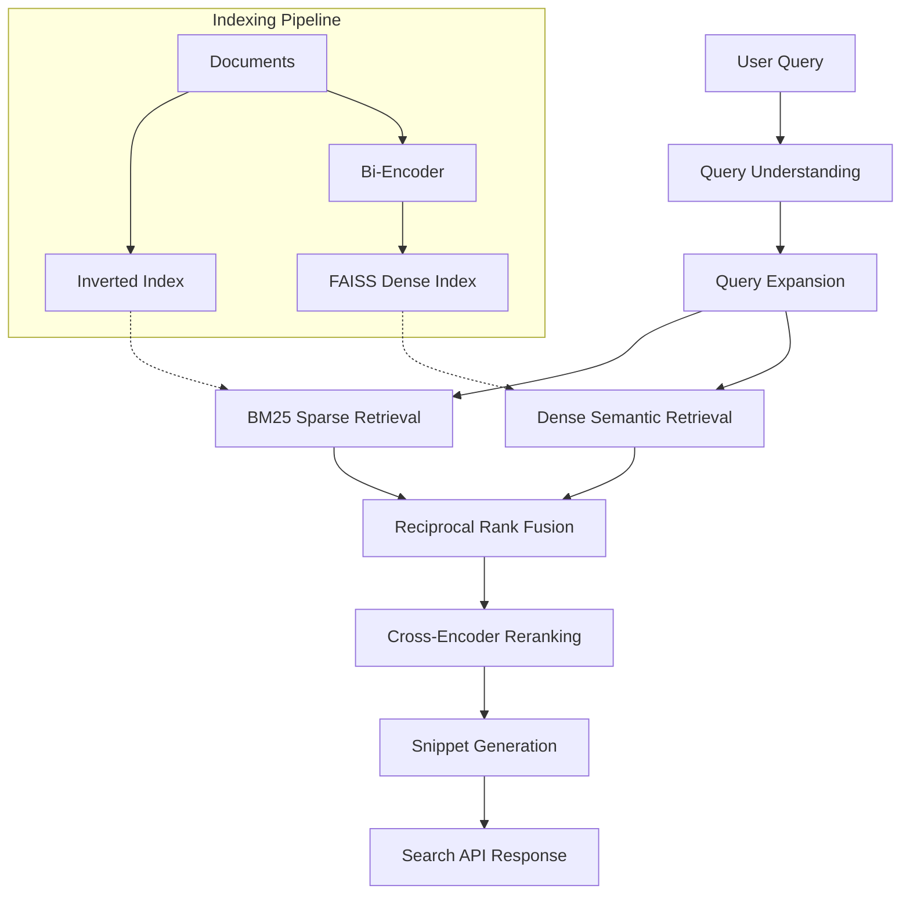
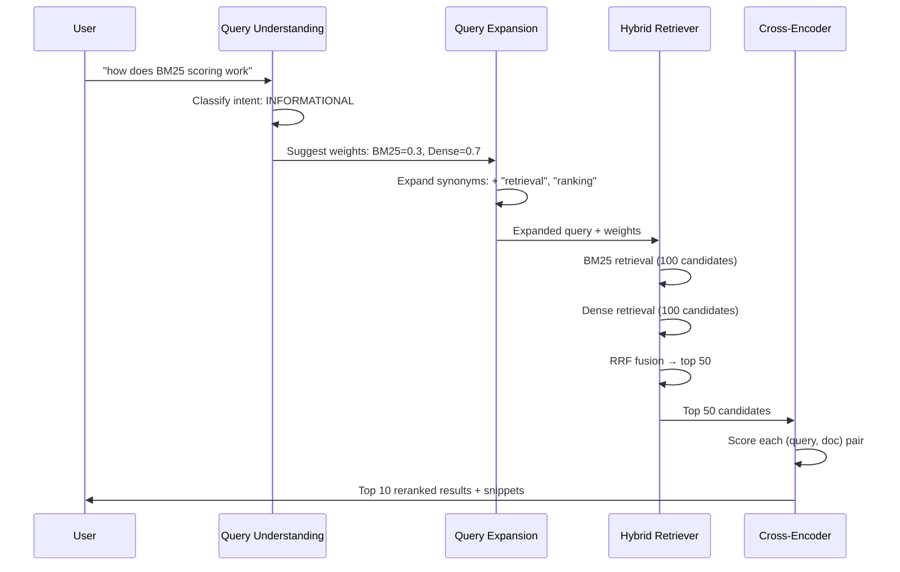
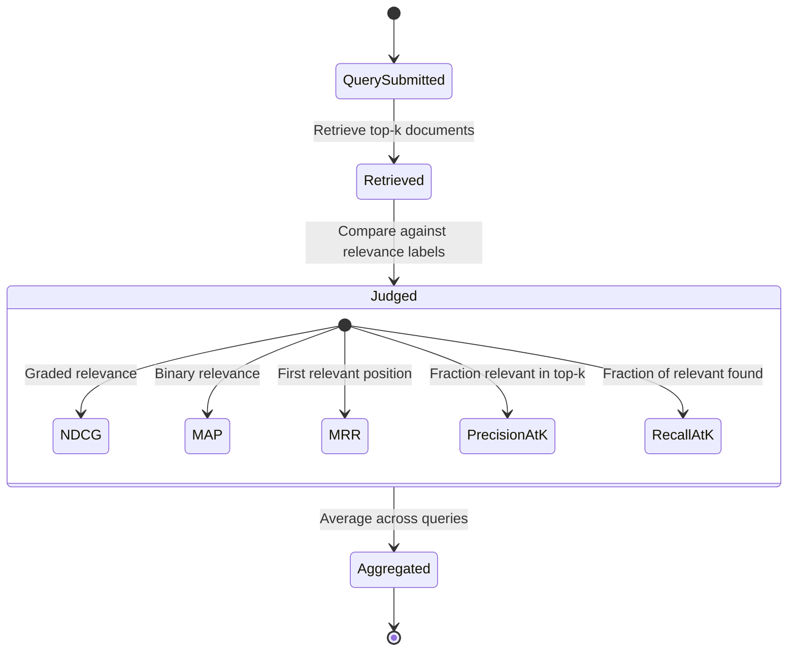

# AI-Powered Search Engine

Full search engine with BM25 sparse retrieval, dense semantic search, hybrid fusion, learned ranking (LambdaMART + neural cross-encoder), query understanding, and a search UI — indexing and searching document collections end to end.

## Theory & Background

### Core Concept

Modern search engines face a fundamental tension: keyword matching (sparse retrieval) is precise but misses synonyms and paraphrases, while semantic matching (dense retrieval) captures meaning but can drift from the user's exact intent. This project builds both from scratch and fuses them, then layers on learned ranking to combine the best of both worlds.

The pipeline mirrors production search systems: index documents with both an inverted index (BM25) and a dense vector index (FAISS), retrieve candidates from both, fuse rankings with Reciprocal Rank Fusion, rerank the top results with a cross-encoder, and serve results through a FastAPI endpoint with snippet highlighting.

### Search Pipeline Architecture



### BM25 Scoring

BM25 is the backbone of sparse retrieval. It scores each document by how well its terms match the query, with two key refinements over raw term frequency: saturation (diminishing returns for repeated terms) and length normalization (longer documents don't get unfair advantage).

For a query $Q$ with terms $q_1, \ldots, q_n$, the BM25 score of document $d$ is:

```math
\text{BM25}(d, Q) = \sum_{i=1}^{n} \text{IDF}(q_i) \cdot \frac{f(q_i, d) \cdot (k_1 + 1)}{f(q_i, d) + k_1 \cdot \left(1 - b + b \cdot \frac{|d|}{\text{avgdl}}\right)}
```

where $f(q_i, d)$ is the frequency of term $q_i$ in document $d$, $|d|$ is the document length, $\text{avgdl}$ is the average document length across the corpus, $k_1 = 1.5$ controls term frequency saturation, and $b = 0.75$ controls length normalization. The IDF component is:

```math
\text{IDF}(q_i) = \ln\left(\frac{N - n(q_i) + 0.5}{n(q_i) + 0.5} + 1\right)
```

where $N$ is the total number of documents and $n(q_i)$ is the number of documents containing term $q_i$. Rare terms get high IDF; common terms get low IDF.

### Dense Retrieval

Dense retrieval encodes queries and documents into a shared embedding space using a bi-encoder (sentence transformer). Relevance is measured by cosine similarity between the query vector and each document vector. The FAISS index enables sub-linear nearest-neighbor search over the document embeddings.

The bi-encoder architecture encodes query and document independently, which means document embeddings can be precomputed at index time. At query time, only the query needs encoding — then a single matrix multiply against the index retrieves the top-$k$ nearest neighbors.

### Reciprocal Rank Fusion

RRF merges two ranked lists without requiring score calibration. Each document's fused score is the sum of reciprocal ranks across all retrieval systems:

```math
\text{RRF}(d) = \sum_{s \in \mathcal{S}} \frac{w_s}{k + \text{rank}_s(d)}
```

where $\mathcal{S}$ is the set of retrieval systems (BM25 and dense), $\text{rank}_s(d)$ is the rank of document $d$ in system $s$, $k = 60$ is a smoothing constant that prevents top-ranked documents from dominating, and $w_s$ is the weight for system $s$. The implementation uses $w_{\text{BM25}} = 1.0$ and $w_{\text{dense}} = 1.0$ by default, with query-intent-based adjustment.

### Query Understanding and Retrieval Strategy



### LambdaMART: Learning to Rank

LambdaMART optimizes NDCG directly through lambda gradients — the key insight is that you don't need to differentiate NDCG itself. Instead, for each pair of documents where one is more relevant than the other, you compute a "lambda" gradient that accounts for how much swapping their positions would change NDCG.

The lambda gradient for a pair $(i, j)$ where document $i$ is more relevant than $j$:

```math
\lambda_{ij} = \frac{1}{1 + e^{\sigma(s_i - s_j)}} \cdot \left|\Delta \text{NDCG}_{ij}\right|
```

where $s_i, s_j$ are the current model scores, $\sigma$ controls the sigmoid steepness, and $|\Delta \text{NDCG}_{ij}|$ is the change in NDCG from swapping positions $i$ and $j$. This weighting means the model focuses its gradient budget on swaps that matter most for the ranking metric.

### Evaluation Metrics



**NDCG** (Normalized Discounted Cumulative Gain) handles graded relevance — a highly relevant document at rank 1 contributes more than a marginally relevant one at rank 5. **MAP** (Mean Average Precision) averages precision at each relevant document's rank. **MRR** (Mean Reciprocal Rank) measures how quickly the first relevant result appears.

### Tradeoffs and Alternatives

**BM25 vs. dense-only retrieval**: BM25 excels at exact keyword matching and rare entity queries. Dense retrieval handles paraphrases and semantic similarity. Hybrid fusion consistently outperforms either alone, at the cost of maintaining two indexes.

**Bi-encoder vs. cross-encoder**: Bi-encoders are fast (precompute document embeddings) but less accurate. Cross-encoders jointly encode query-document pairs for higher accuracy but are too slow for first-stage retrieval. The standard pattern — used here — is bi-encoder retrieval followed by cross-encoder reranking.

**RRF vs. learned fusion**: RRF is parameter-free and robust. Learned fusion (e.g., a small model that combines scores) can outperform RRF but requires training data and risks overfitting. RRF is the safer default.

**LambdaMART vs. neural rankers**: LambdaMART (gradient-boosted trees) is fast, interpretable, and works well with hand-crafted features. Neural rankers (cross-encoders) are more powerful but slower and harder to debug. This project implements both.

### Key References

- Robertson & Zaragoza, "The Probabilistic Relevance Framework: BM25 and Beyond" (2009) — [Foundations and Trends](https://www.staff.city.ac.uk/~sbrp622/papers/foundations_bm25_review.pdf)
- Karpukhin et al., "Dense Passage Retrieval for Open-Domain Question Answering" (2020) — [arXiv](https://arxiv.org/abs/2004.04906)
- Cormack et al., "Reciprocal Rank Fusion outperforms Condorcet and individual Rank Learning Methods" (2009) — [SIGIR](https://dl.acm.org/doi/10.1145/1571941.1572114)
- Burges, "From RankNet to LambdaRank to LambdaMART: An Overview" (2010) — [Microsoft Research](https://www.microsoft.com/en-us/research/publication/from-ranknet-to-lambdarank-to-lambdamart-an-overview/)
- Nogueira & Cho, "Passage Re-ranking with BERT" (2019) — [arXiv](https://arxiv.org/abs/1901.04085)

## Real-World Applications

Search is infrastructure — nearly every digital product relies on some form of information retrieval. The techniques in this project power systems that handle billions of queries daily.

| Industry | Use Case | Impact |
|----------|----------|--------|
| E-Commerce | Product search combining keyword matching with semantic understanding of shopper intent | Increases purchase conversion 15–30% by surfacing relevant products even when query terms don't match product descriptions |
| Enterprise Knowledge Management | Internal document search across wikis, Slack, email, and code repositories | Reduces time-to-answer from hours to seconds; hybrid retrieval finds documents that keyword search alone misses |
| Legal & Compliance | Case law and regulatory document retrieval with cross-encoder reranking for precision | Cuts legal research time by 50–70%; ensures relevant precedents aren't missed due to terminology differences |
| Healthcare | Clinical literature search matching patient symptoms to research papers and treatment guidelines | Enables evidence-based decisions by surfacing semantically relevant studies, not just keyword matches |
| Customer Support | Ticket deflection by matching incoming questions to existing knowledge base articles | Reduces support ticket volume 20–40% by automatically suggesting relevant help articles |

## Project Structure

```
├── src/
│   ├── indexing/
│   │   ├── inverted_index.py  # BM25 inverted index from scratch
│   │   ├── dense_index.py     # FAISS dense vector index
│   │   └── indexer.py         # Document indexing pipeline
│   ├── retrieval/
│   │   ├── bm25.py            # BM25 sparse retrieval with query-time boosting
│   │   ├── dense.py           # Dense bi-encoder retrieval
│   │   └── hybrid.py          # Reciprocal Rank Fusion
│   ├── ranking/
│   │   ├── lambdamart.py      # LambdaMART learning-to-rank
│   │   └── cross_encoder.py   # Neural cross-encoder reranker
│   ├── query/
│   │   ├── understanding.py   # Intent classification (navigational/informational/transactional)
│   │   └── expansion.py       # Synonym + pseudo-relevance feedback expansion
│   ├── serving/
│   │   ├── api.py             # FastAPI search endpoint
│   │   └── snippets.py        # Snippet extraction and query term highlighting
│   └── evaluation/
│       └── metrics.py         # NDCG, MAP, MRR, Precision@k, Recall@k
├── demo/
│   └── app.py                 # Gradio search UI
├── data/
│   └── sample_corpus/         # Sample documents (JSONL)
├── requirements.txt
└── README.md
```

## Quick Start

```bash
pip install -r requirements.txt

# Index a document corpus
python -m src.indexing.indexer --input data/sample_corpus/

# Start the search API
python -m src.serving.api  # serves on :8000

# Search via API
curl "http://localhost:8000/search?q=information+retrieval&top_k=5"
```

## Implementation Details

### What makes this non-trivial

- **Inverted index from scratch**: The BM25 index is built without any IR library — tokenization, posting lists, IDF computation, and BM25 scoring are all implemented directly, with incremental document addition and JSON serialization.

- **LambdaMART lambda gradients**: The lambda gradient computation iterates over all document pairs per query, computing the NDCG delta from swapping each pair's positions. This $O(n^2)$ per-query cost is the price of directly optimizing a ranking metric rather than a pointwise surrogate.

- **Cross-encoder fallback scoring**: When the transformer model isn't available, the reranker falls back to a feature-based scorer using term overlap, position weighting (early matches score higher), and length normalization — a reasonable proxy that keeps the pipeline functional.

- **Query intent → retrieval weights**: The query understanding module classifies intent (navigational, informational, transactional) using pattern matching, then adjusts BM25/dense weights accordingly. Navigational queries favor exact BM25 matching; informational queries favor dense semantic search.

- **Snippet generation with sliding window**: Snippets are extracted by sliding a sentence window over the document, scoring each window by query term density, and highlighting matching terms. This avoids the naive approach of just returning the first N characters.
